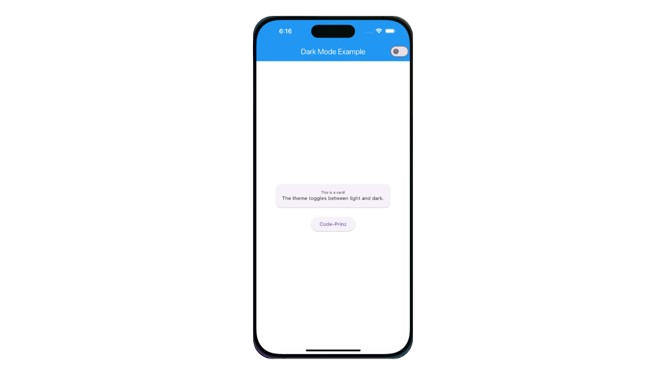
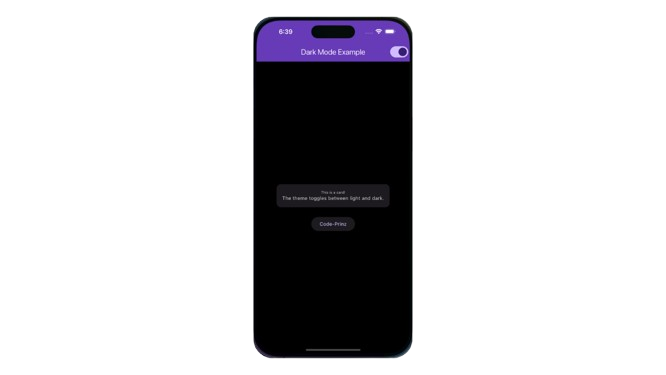

# 🌙 Flutter Dark Mode Toggle with Clean UI  

This repository demonstrates how to implement **Dark Mode** in a Flutter app with a clean and modern UI. The app uses **Provider** for state management, ensuring a seamless switch between light and dark themes. Perfect for developers looking to enhance their Flutter app's UX/UI! 🚀  

---

## 📸 Preview  

| Light Mode | Dark Mode |  
|------------|-----------|  
|  |  |  

---

## 🛠 Features  

- **Dynamic Theme Switching**  
  Toggle between light and dark modes instantly.  
- **State Management with Provider**  
  Efficient and scalable state handling.  
- **Clean UI Design**  
  Responsive and visually appealing interface.  
- **Fully Customizable**  
  Extendable for your own app’s requirements.  

---

## 🏗️ Project Structure  

```plaintext
lib/
├── main.dart           # App entry point
├── theme_provider.dart # Handles theme switching logic
└── home_screen.dart    # Contains the UI for the home screen
